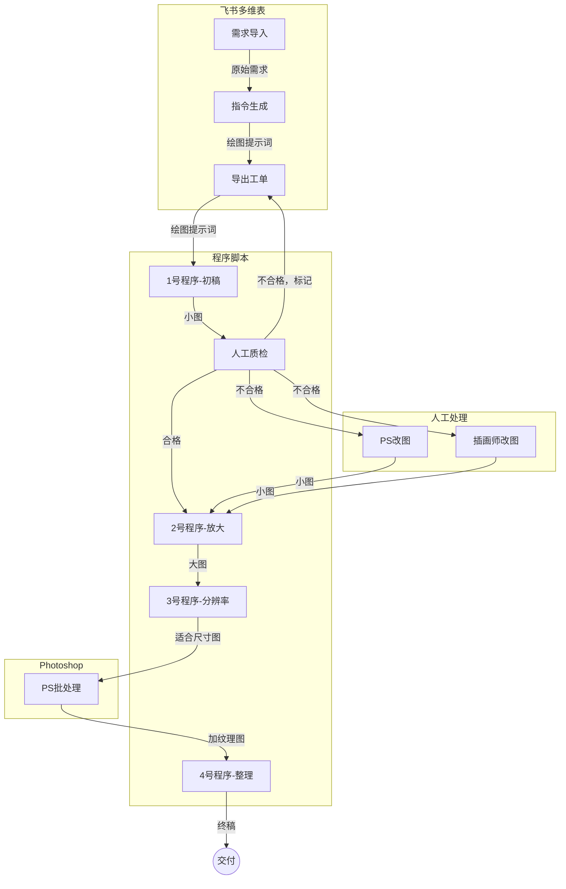

# ai-illustration-factory

这是 [🎨AI插画自动化全流程实操手册](https://qvokpfxqsh.feishu.cn/wiki/KJMgwMn0wiXeiqkFvHHcHFxAn8B) 的Python代码部分，并非完整项目。该系统能实现从一列Excel内容大批量生成特定风格的AI插画，AI自动生成文生图提示词，支持人物一致性，并附带大量后期修补工具。

整个项目还包含飞书多维表、财务表、ComfyUI工作流等[其他资源](https://qvokpfxqsh.feishu.cn/wiki/YLozwQC4piBqTNklhERcyrmonEg)，与Python代码配合使用。大致使用流程如下，详细用法见手册。

代码文件简介：

- runcomfy_utils.py：Runcomfy的基础功能。
- child_book_utils.py：插画工厂所需的基础能力。
- child_book_1_gen.py：1号程序，从绘图提示词生成小图。
- child_book_2_upscale.py：2号程序，把小图放大成高清图。
- child_book_3_ppi.py：3号程序，把高清图的分辨率调成客户要求的规格。
- child_book_4_organize.py：4号程序，把成品图按项目整理。
- child_book_f_ps.py：从高清大图里挑出需要人工PS修改的，复制到专门的目录。
- child_book_f_fix.py：从高清大图里挑出需要插画师修改的，复制到专门的目录。
- child_book_m_crop.py：把高清大图裁剪一块局部用于精修。
- child_book_m_paste.py：把精修过的局部准确贴回原位置。

我使用这套系统成功接过AI插画商单，流程顺利跑通。接单的详细经历见：[卖AI图，从开单到金盆洗手](https://victor42.eth.limo/post/automate-ai-illustrations-production/)

---

Created by [Victor_42](https://victor42.work/)
